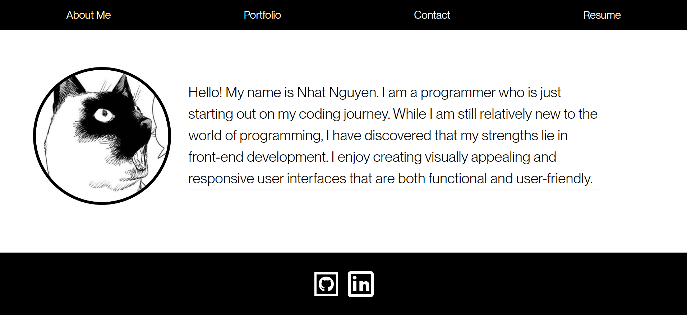

#React Portfolio

## Description

This webpage is a mockup portfolio of work as a coder made using React. The site displays a person's projects and coding experence along with a section people can use to contact the programmer. User's can also download the resume of the programmer on the site. At the bottom of each page, the footer has links to the programmer's linkedin and github.

## Installation

## Usage

This can be used display a coders work experience and kowledge of topics. It gives the user a organized space to keep there body of work. Each section is made to help prospective employers evaluote a persons skill level and work experence.The site also allows for employers to contact the user and links to profiles the user also has.

## Screenshot

## Credits

N/A

## License

Please refer to the LICENSE in the repo.
